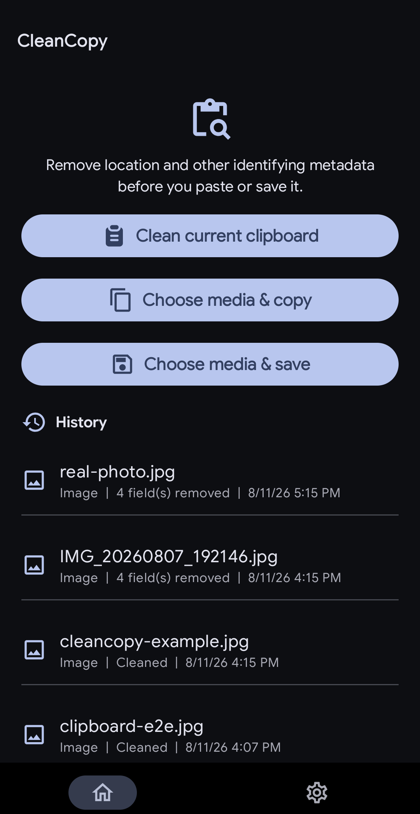
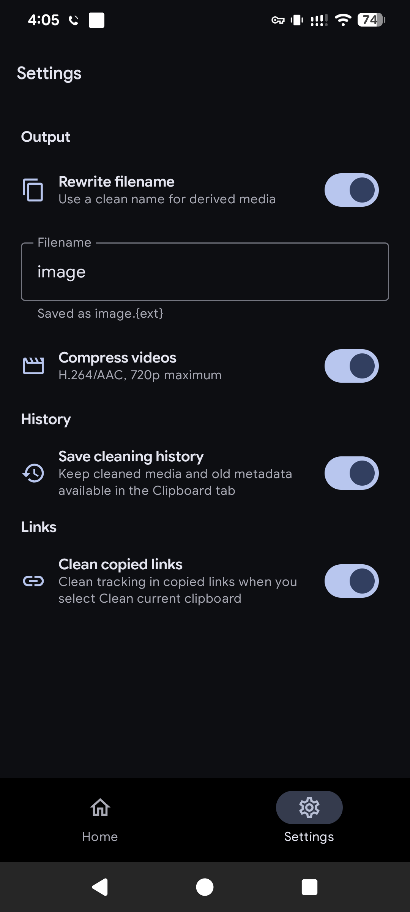
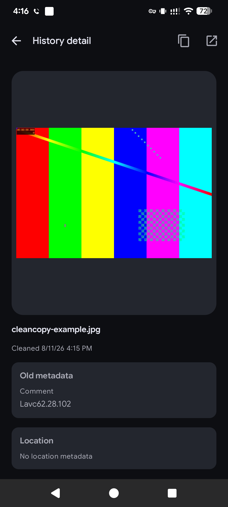

# CleanCopy

CleanCopy makes clean copies of images, videos, and links before you share them.

## Screenshots

<table>
  <tr>
    <td align="center">
      
      <br>
      <sub>Home</sub>
    </td>
    <td align="center">
      
      <br>
      <sub>Settings</sub>
    </td>
    <td align="center">
      
      <br>
      <sub>History detail</sub>
    </td>
  </tr>
</table>

## What it does

- Removes identifying metadata from images and videos.
- Cleans tracking parameters and redirect wrappers from links.
- Copies cleaned media back to the clipboard, or saves it to a folder.
- Adds optional Quick Settings tiles for fast access.
- Keeps an optional local history of cleaned items.

## Install

Download the latest APK from [GitHub Releases](https://github.com/bgwastu/cleancopy/releases).

For automatic updates, install [Obtainium](https://github.com/ImranR98/Obtainium), tap **Add app**, and paste this repository URL:

```text
https://github.com/bgwastu/cleancopy
```

Obtainium watches the GitHub Releases page and can notify you when a new APK is available. CleanCopy does not currently have an app-store listing, so this is the simplest update path.

## Use it

1. Open CleanCopy and choose **Choose media & copy**, or add the Quick Settings tile.
2. Select one or more images or videos.
3. CleanCopy removes supported metadata and copies the result.

Use **Clean current clipboard** when the media is already in your clipboard. Link cleaning is enabled from Settings.

## Build

```text
./gradlew lintDebug testDebugUnitTest assembleDebug
```

## License

[MIT](LICENSE) © Bagas Wastu
